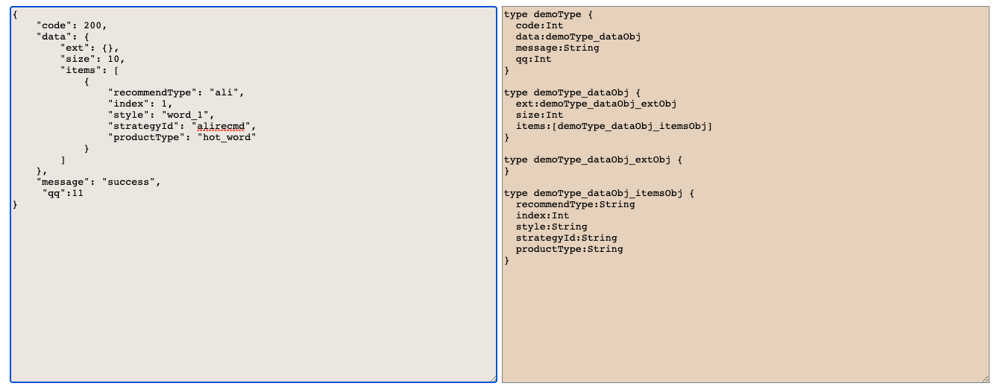

# zl-create-graphql-type
  在使用node编写graphql接口时：自动解析数据结构，动态生成对应的graphql类型

## 1. 模块基本说明
* 此模块即可在浏览器环境下运行，也可在node环境下运行
* 在浏览器环境下运行，将会返回生成的graphql类型字符串内容
* 在node环境下运行，即可返回字符串内容也可直接生成文件到需要的位置处

**演示：**
   https://zl-fire.github.io/code/create_graphql_type.html

   

## 2. 起因

在开发中，需要将一个项目原本的rest风格接口转换为graphql方式的接口，如下：

  * java的dubbo接口----》node中间层处理生成rest接口----》前端页面调node的rest接口
   **变为**
  * java的dubbo接口----》node中间层处理生成graphql接口----》前端页面调node的graphql接口

由于graphql中每个接口的参数，返回值等，都需要显示的声明graphql对应的类型，且grahpql的类型就 String、Int、Float、Boolean 和 ID 几种，比较单调. 

而手动构建graphql接口所需要的类型也比较麻烦,所以这里写了个 graphql类型生成器，自动解析数据结构，然后生成相应的graphql类型。


## 3. 安装模块

* ***使用`script`标签就进行引入使用***
   ```js
      <script src="https://cdn.jsdelivr.net/npm/zl-create-graphql-type@1.0.3/create_graphql_type.js"></script>
   ```
* ***使用`import`方式引入使用***
   ```js

       1. 安装： npm i  zl-create-graphql-type -S

       2. 引入： import createGraphqlType from 'zl-create-graphql-type'
   ```

* ***使用`require`方式在nodejs中引入使用***
   ```js
 
       1. 安装： npm i  zl-create-graphql-type -S

       2. 引入： var createGraphqlType = require("zl-create-graphql-type")
   ```

## 4. 使用示例

```js
  const parObj = {
  typeObj: { // typeObj表示要转换的类型对象
    code: 200,
    data: {
      ext: {},
      size: 10,
      items: [
        {
          recommendType: 'ali',
          index: 1,
          style: 'word_1',
          strategyId: 'alirecmd',
          productType: 'hot_word'
        }
      ]
    },
    message: 'success'
  },
  typeWay: 'type', // type表示输出类型，input表示输入类型
  typeName: 'testType' // 定义的graphql类型名字
}

// 执行
createGraphqlType(parObj)
  .then((d) => {
    // d为成的结果
    console.log('执行完成,生成的graphql类型如下：\n', d)
  })

下面是执行结果:
/*
执行完成,生成的graphql类型如下：
 type testType {
  code:Int
  data:testType_dataObj
  message:String
}

type testType_dataObj {
  ext:testType_dataObj_extObj
  size:Int
  items:[testType_dataObj_itemsObj]
}

type testType_dataObj_extObj {
}

type testType_dataObj_itemsObj {
  recommendType:String
  index:Int
  style:String
  strategyId:String
  productType:String
}
*/

```

## 5. createGraphqlType函数参数说明
```js
/**
* @function 直接暴露给用户使用的函数模块
* @description 自动识参数数据结构，动态生成graphql类型定义
* @param paramObj {Objectl} 接收一个对象参数
* @param paramObj.filePath {String|Boolean} 类型定义将输出到此string代表的路径文件，如果值为false:返回字符串到函数调用处，默认为false
* @param paramObj.rewrite {Boolean} 表示是否以覆盖原文件内容的方式写入。true表示是,false表示以追加的方式写入文件. 默认为false:追加
* @param paramObj.typeWay {String}  typeWay字段值为:input或type,input表示是输入类型,type表示输出类型
* @param paramObj.typeName {String} 要构建的graphql类型的名字
* @param paramObj.typeObj {Objectl} 要转换为graphql类型的实际数据结构（注意：为了识别正确的类型，数据示例的字段值不能为undefined或者null）
* @return graphql类型定义字符串 / void(生成graphql类型定义文件)
* @author 张路 2021/08/08 
* @example
* {
*     "code": 200,
*     "data": {
*         "ext": {},
*         "size": 10,
*         "items": [
*             {
*                 "ext": ""
*             }
*         ]
*     },
*     "message": "success"
* }
*/
```
同时请注意：
 1. 注意：为了识别正确的类型，作为参数的数据示例的字段值**不能为undefined或者null**，给上一个任何的代表类型的值都可以。
 2. 对于数组类型数据，在将其解析为grphql类型数据结构时，只需要给出一个对象元素信息即可，解析器默认也只会解析第一个元素信息生成对应类型（当然：字段值不能为null或者undefined)
 3. 对于数组类型数据，请不要给空数组[],请给上一个数组元素，从而让解析器识别其对应类型。
 4. 在客户端浏览器中，只能执行生成对应的graphql类型字符串，而不能写入文件中，因为客户端js无法读写本地磁盘

## 6. 其他使用示例: 将生成的graphql类型定义写入到本地文件中

1. ========以覆盖原文件内容的方式，将graphql类型写入到文件中========
```js
let parObj = {
    filePath: __dirname + '/test.graphql',  //要写入的文件路径
    rewrite: true,
    typeObj: {
        "code": 200,
        "data": {
            "ext": {},
            "size": 10,
            "items": [
                {
                    "ext": "",
                    "resourceId": "",
                    "mediaAssetInfo": "",
                    "productId": "python工程师",
                    "reportData": {
                        "eventClick": true,
                        "data": {
                            "mod": "popu_895",
                            "extra": "{\"utm_medium\":\"distribute.pc_search_hot_word.none-task-hot_word-alirecmd-1.nonecase\",\"hotword\":\"python工程师\"}",
                            "dist_request_id": "1628386601938_69042",
                            "index": "1",
                            "strategy": "alirecmd"
                        },
                        
                        "eventView": true
                    },
                    "recommendType": "ali",
                    "index": 1,
                    "style": "word_1",
                    "strategyId": "alirecmd",
                    "productType": "hot_word"
                }
            ]
        },
        "message": "success"
    },
    typeWay: 'type',
    typeName: 'testType'
};
// 执行
createGraphqlType(parObj)
    .then(() => {
        console.log("执行完成")
    })
```


2. ========以追加原文件内容的方式，将生成的graphql类型定义写入到文件中========
```js
let parObj = {
    filePath: __dirname + '/test.graphql',  //要写入的文件路径
    rewrite: false, //默认追加方式
    typeObj: {
        "code": 200,
        "data": {
            "ext": {},
            "size": 10,
            "items": [
                {
                    "ext": "",
                    "resourceId": "",
                    "mediaAssetInfo": "",
                    "productId": "python工程师",
                    "reportData": {
                        "eventClick": true,
                        "data": {
                            "mod": "popu_895",
                            "extra": "{\"utm_medium\":\"distribute.pc_search_hot_word.none-task-hot_word-alirecmd-1.nonecase\",\"hotword\":\"python工程师\"}",
                            "dist_request_id": "1628386601938_69042",
                            "index": "1",
                            "strategy": "alirecmd"
                        },
                        
                        "eventView": true
                    },
                    "recommendType": "ali",
                    "index": 1,
                    "style": "word_1",
                    "strategyId": "alirecmd",
                    "productType": "hot_word"
                }
            ]
        },
        "message": "success"
    },
    typeWay: 'type',
    typeName: 'testType'
};
// 执行
createGraphqlType(parObj)
    .then(() => {
        console.log("执行完成")
    })
```


3. ========每次都创建新文件，写入生成的graphql类型地定义========
```js
// 只有每次创建时的path路径不一样即可
let parObj = {
    filePath: __dirname + "/" + new Date().toLocaleString() + '.graphql', //要写入的文件路径
    typeObj: {
        "code": 200,
        "data": {
            "ext": {},
            "size": 10,
            "items": [
                {
                    "ext": "",
                    "resourceId": "",
                    "mediaAssetInfo": "",
                    "productId": "python工程师",
                    "reportData": {
                        "eventClick": true,
                        "data": {
                            "mod": "popu_895",
                            "extra": "{\"utm_medium\":\"distribute.pc_search_hot_word.none-task-hot_word-alirecmd-1.nonecase\",\"hotword\":\"python工程师\"}",
                            "dist_request_id": "1628386601938_69042",
                            "index": "1",
                            "strategy": "alirecmd"
                        },
                        
                        "eventView": true
                    },
                    "recommendType": "ali",
                    "index": 1,
                    "style": "word_1",
                    "strategyId": "alirecmd",
                    "productType": "hot_word"
                }
            ]
        },
        "message": "success"
    },
    typeWay: 'type',
    typeName: 'testType'
};
// 执行
createGraphqlType(parObj)
    .then(() => {
        console.log("执行完成")
    })
```
